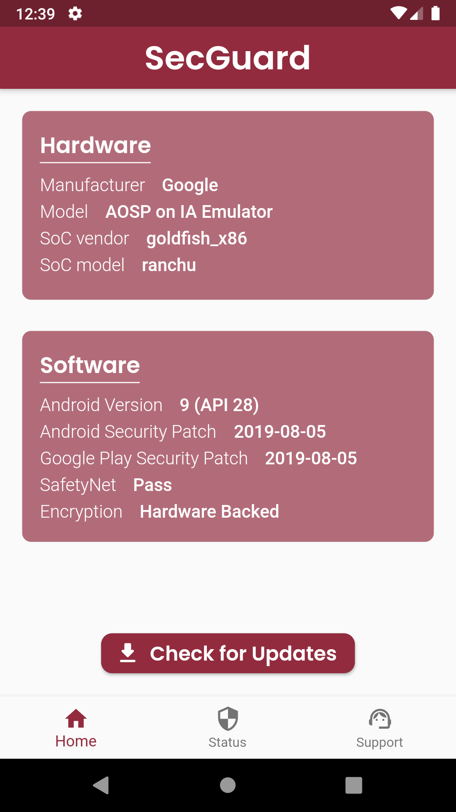
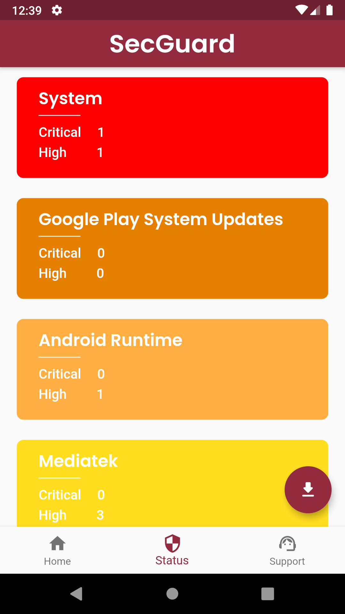
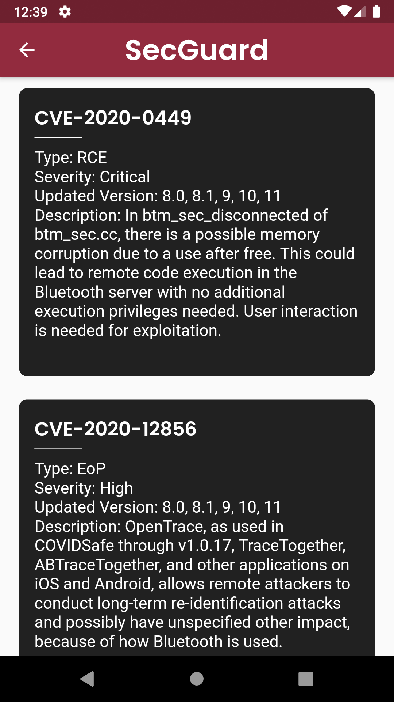

# :computer: 2020 Hackathor Contest Project
 
This repository includes source code of the **SecGuard** Android application's which developed for [2020 Hackathor Contest Project](https://www.hackathor.net/).

## Dependencies 

- `Flutter` - 1.22.4
- `Android SDK` - 29.0.2

## Application's UI 
               

## Contributors

- **Oğuz Bakır** : [Mail](mailto:oguz298@hacettepe.edu.tr) - [GitHub](https://github.com/oguzbakir) - [LinkedIn](https://www.linkedin.com/in/oguzbakir/)
- **Fidan Samet** : [Mail](mailto:fidansamet@hacettepe.edu.tr) - [GitHub](https://github.com/fidansamet) - [LinkedIn](https://tr.linkedin.com/in/fidansamet) 
- **Gökhan Özeloğlu** : [Mail](mailto:gozeloglu@gmail.com) - [GitHub](https://github.com/gozeloglu) - [LinkedIn](https://www.linkedin.com/in/gokhanozeloglu/)
